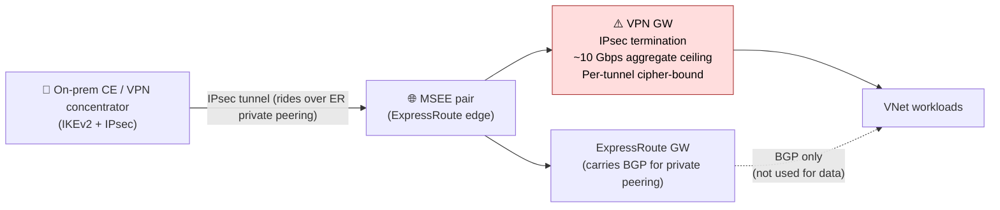
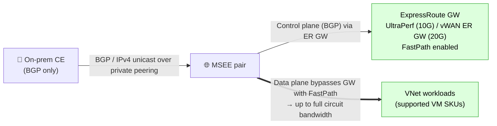

# Migrating off IPsec-over-ExpressRoute to ExpressRoute-only


A practical guide for hybrid network engineers who originally deployed **IPsec on top of ExpressRoute** (for encryption-in-transit) and now want to retire the VPN overlay and run **ExpressRoute private peering only** — recovering circuit throughput, eliminating the IPsec chokepoint, and unlocking ExpressRoute FastPath.

## Table of Contents

- [Why this migration?](#why-this-migration)
- [The chokepoint: IPsec on top of ExpressRoute](#the-chokepoint-ipsec-on-top-of-expressroute)
- [What ExpressRoute-only buys you](#what-expressroute-only-buys-you)
- [Before & after topology](#before--after-topology)
- [Migration plan (4 steps)](#migration-plan-4-steps)
- [If encryption is still required](#if-encryption-is-still-required)
- [Common ExpressRoute design considerations](#common-expressroute-design-considerations)
- [Validation commands cheat sheet](#validation-commands-cheat-sheet)
- [References](#references)
- [License](#license)

---

## Why this migration?

Running **IPsec over ExpressRoute private peering** is a common pattern when compliance or a security team mandates encryption-in-transit even over a private circuit. The trade-off is real: the IPsec tunnels — not the ExpressRoute circuit — become the throughput ceiling. If that mandate goes away (or you can move encryption down to Layer 2 with MACsec, or up to the application with TLS), dropping the overlay frees up a lot of capacity and simplifies the data plane.

---

## The chokepoint: IPsec on top of ExpressRoute

When you tunnel IPsec across an ExpressRoute private peering, the circuit underlay is *not* the bottleneck — the IPsec gateway and per-tunnel throughput are. Concretely:

- **VPN Gateway aggregate throughput** is capped per SKU (today's top SKU lands around **~10 Gbps aggregate**, and that's *aggregate across all tunnels* — not per tunnel).
- **Per-tunnel throughput** is much lower and varies by cipher / IKE proposal. AES-GCM with hardware-accelerated CPUs gives you the best numbers; CBC + SHA-2 is materially slower. Real-world per-tunnel ceilings are well under 1 Gbps in most configurations.
- **Number of tunnels** is bounded per gateway SKU.
- **CPU on the on-prem head-end** matters too — your CE/concentrator must keep up with the same cipher work.
- **FastPath cannot help here** because traffic is encapsulated in IPsec — every packet must traverse the VPN GW data plane.

You bought a 10 Gbps (or higher) ExpressRoute circuit and you're consuming maybe 1–4 Gbps of it because the IPsec gateways are the gating factor.

---

## What ExpressRoute-only buys you

| Lever | IPsec-over-ER | ExpressRoute-only |
| --- | --- | --- |
| **GW data-plane ceiling** | ~10 Gbps VPN GW aggregate (SKU-dependent) | Up to **10 Gbps** (UltraPerformance ER GW) or **20 Gbps** (vWAN ER GW) |
| **Per-tunnel cap** | Yes — varies by cipher | N/A (no tunnels) |
| **FastPath eligible** | ❌ Traffic rides inside IPsec; GW must decrypt | ✅ FastPath bypasses the GW data plane → traffic can reach **full circuit bandwidth** (up to 100 Gbps on ExpressRoute Direct) |
| **CPU on on-prem head-end** | Significant (encryption) | Forwarding only |
| **Latency overhead** | IPsec encap/decap | None |
| **Encryption in transit** | Yes (IPsec) | None at L3 — see [encryption options](#if-encryption-is-still-required) |

> **FastPath is the headline:** with FastPath enabled and the supported VM SKUs in the destination VNet, inbound flows from on-prem hit the VNet without traversing the ER GW data plane. The GW is still in the control plane (BGP, routing), but packets bypass it. With IPsec on top, FastPath is not possible — every packet has to be decrypted by the VPN GW.

---

## Before & after topology

### Before — IPsec over ExpressRoute (the chokepoint)



### After — ExpressRoute-only with FastPath



---

## Migration plan (4 steps)

### Step 1 — Inventory what's advertised on **both** paths

Before deleting anything, you must know exactly which prefixes are riding the VPN path vs. the ExpressRoute path.

**Why this matters:** Azure's hybrid path selection always **prefers ExpressRoute-learned prefixes over S2S VPN-learned prefixes for the same prefix**, even when both are running BGP. But if you were running **disjoint prefixes** or **longest-prefix match (LPM)** over the VPN tunnels (e.g., a more-specific carried only on VPN as a deliberate steering choice), those prefixes will **disappear** the moment you delete the VPN GW unless they also exist in the ExpressRoute advertisements.

**On the on-prem head-end (Cisco IOS / IOS-XE example):**

```text
# Routes WE are advertising to Azure over the VPN/ER neighbor:
show ip bgp vpnv4 all neighbors <neighbor-ip> advertised-routes

# Routes Azure is advertising to US from that neighbor:
show ip bgp vpnv4 all neighbors <neighbor-ip> routes
```

Run these on **both** the VPN-side BGP peer and the ER-side BGP peer (the MSEE peers) and diff them. Anything present only on the VPN side is a migration risk.

**On the Azure side:**

```bash
# ER private peering — Azure-learned routes from the MSEE
az network express-route list-route-tables \
  --resource-group <rg> --name <circuit> \
  --peering-name AzurePrivatePeering --path primary -o table

# ER private peering — routes Azure advertises to on-prem
az network express-route list-route-tables-summary \
  --resource-group <rg> --name <circuit> \
  --peering-name AzurePrivatePeering --path primary

# ER GW BGP peer status + learned routes
az network vnet-gateway list-bgp-peer-status -g <rg> -n <er-gw>
az network vnet-gateway list-learned-routes  -g <rg> -n <er-gw>
az network vnet-gateway list-advertised-routes -g <rg> -n <er-gw> --peer <peer-ip>

# VPN GW (so you can confirm what would be lost):
az network vnet-gateway list-bgp-peer-status -g <rg> -n <vpn-gw>
az network vnet-gateway list-learned-routes  -g <rg> -n <vpn-gw>
```

Save these outputs as your **pre-change baseline**.

### Step 2 — Cut over in a maintenance window

Since the ExpressRoute private peering is already up and forwarding, the cutover is fast:

1. Open a change window (and have a rollback plan — keep the VPN config saved on the head-end).
2. **Delete the VPN GW connection** (the IPsec connection object), then delete the **VPN gateway** itself.
   ```bash
   az network vpn-connection delete -g <rg> -n <conn-name>
   az network vnet-gateway delete   -g <rg> -n <vpn-gw>
   ```
3. Re-run the validation commands from Step 1 on the **ExpressRoute side only**. Confirm:
   - BGP is still up on the ER GW
   - Inbound prefixes (Azure → on-prem) match the baseline
   - Outbound prefixes (on-prem → Azure) match the baseline
   - Application traffic still flows in both directions

If anything is missing, add the missing prefixes to the on-prem ER advertisement (or re-create the VPN connection from the saved config and roll back).

### Step 3 — Right-size the ExpressRoute gateway and circuit

Now that you're ExpressRoute-only:

- **GW SKU:** if the GW was sized around the IPsec ceiling, you may want to bump it. Options: Standard / HighPerformance / UltraPerformance, and ErGw1AZ / ErGw2AZ / ErGw3AZ for zone-redundant. **You can scale UP but not DOWN** without delete + recreate.
- **Circuit bandwidth:** same rule — bandwidth **upgrades** are non-disruptive (provider-dependent), **downgrades require a new circuit**.
- **Enable FastPath** on the ER GW (requires UltraPerformance or ErGw3AZ on classic VNet, or vWAN ER GW). Confirm the destination VNet uses [supported VM SKUs](https://learn.microsoft.com/azure/expressroute/about-fastpath).
- **Bow-tie / dual-circuit topology — control your path selection:**
  - **Default behavior:** if the same VNet (or vHub) is connected to **multiple ER circuits** and both advertise the same prefixes, Azure **ECMPs by default**.
    - Exception: **vWAN does not ECMP by default across multiple circuits** — you need a no-op (dummy) route-map applied to the connections to actually program ECMP. See the [vWAN ECMP guidance](https://learn.microsoft.com/azure/virtual-wan/route-maps-about).
  - **Prefer one circuit over another** (active/standby or unequal-cost steering):
    1. **Connection weight** on the VNet connection — higher weight wins (Azure local preference for the connection).
    2. **Local preference** set by the on-prem head-end on outbound advertisements toward Azure (affects Azure → on-prem return path selection from Azure's perspective).
    3. **AS-PATH prepending** on the less-preferred circuit — shortest AS-PATH always wins; prepend the path you want to make less attractive.

### Step 4 — Decommission and document

- Remove unused on-prem IPsec config (IKE policies, crypto maps, tunnel interfaces) from the head-end.
- Update network diagrams and the run-book.
- Update monitoring: VPN GW dashboards / alerts can be removed; add (or expand) ER circuit + ER GW metrics — BitsIn/Out per second, BGP peer status, ARP table, FastPath flow count.

---

## If encryption is still required

If a security mandate says traffic must be encrypted over the circuit, you have a few options that don't involve putting IPsec back on top:

1. **MACsec (Layer 2 encryption) on ExpressRoute Direct** — supported only on **ExpressRoute Direct** circuits (10 Gbps / 100 Gbps ports you own). Not available on provider-managed circuits today. See [MACsec for ExpressRoute Direct](https://learn.microsoft.com/azure/expressroute/expressroute-howto-macsec).
2. **Application-layer encryption (TLS / mTLS)** at the workload — usually free in performance terms (modern CPUs handle TLS at line rate) and gives end-to-end protection independent of the transport.
3. **SD-WAN tunnels with encryption** between the on-prem device and an Azure-hosted SD-WAN NVA — this works, but it largely re-creates the same chokepoint you just removed, so only do this if the requirement is route-limits/throughput split (e.g., overlay carries a subset of prefixes by design).

If none of those fit, you may need to keep the IPsec overlay — but at least size it correctly and accept the ceiling.

---

## Common ExpressRoute design considerations

After the cutover, the usual ExpressRoute design rules still apply:

- **Route limits:**
  - 4,000 IPv4 prefixes (Standard) / 10,000 (Premium) accepted on the MSEE from on-prem.
  - 1,000 IPv4 prefixes advertised from the ExpressRoute GW outbound to the MSEE — aggregate Azure-side VNet prefixes using vWAN route-maps or careful summarization.
  - 9,500 routes learned by the ER GW with `ErGwScale` enabled.
- **BGP design:** use the same AS-PATH and MED hygiene you used over IPsec; nothing changes about the BGP semantics.
- **Resiliency:** use two physically diverse circuits (different peering locations / different providers) for true high availability; ECMP across both by default.
- **Latency:** picking the closest peering location matters now more than ever since you're no longer paying IPsec encap cost.
- **Monitoring:** enable ExpressRoute Traffic Collector for flow-level visibility (5-tuple, bytes, packets) — see [ExpressRoute Traffic Collector overview](https://learn.microsoft.com/azure/expressroute/traffic-collector-overview).

---

## Validation commands cheat sheet

### On-prem (Cisco IOS / IOS-XE)

```text
! BGP summary for the ER neighbor (VRF-aware)
show ip bgp vpnv4 all summary
show ip bgp vpnv4 all neighbors <neighbor-ip>

! What we're sending to Azure
show ip bgp vpnv4 all neighbors <neighbor-ip> advertised-routes

! What Azure is sending us
show ip bgp vpnv4 all neighbors <neighbor-ip> routes

! Path attributes for a specific prefix
show ip bgp vpnv4 all <prefix>/<mask>
```

### Azure CLI

```bash
# Circuit-level
az network express-route show -g <rg> -n <circuit> -o table
az network express-route list-route-tables -g <rg> -n <circuit> \
  --peering-name AzurePrivatePeering --path primary -o table
az network express-route list-route-tables -g <rg> -n <circuit> \
  --peering-name AzurePrivatePeering --path secondary -o table
az network express-route list-route-tables-summary -g <rg> -n <circuit> \
  --peering-name AzurePrivatePeering --path primary
az network express-route list-arp-tables -g <rg> -n <circuit> \
  --peering-name AzurePrivatePeering --path primary

# Classic VNet ER GW
az network vnet-gateway list-bgp-peer-status   -g <rg> -n <er-gw>
az network vnet-gateway list-learned-routes    -g <rg> -n <er-gw>
az network vnet-gateway list-advertised-routes -g <rg> -n <er-gw> --peer <peer-ip>

# vWAN ER GW (effective routes on the hub)
az network vhub get-effective-routes -g <rg> -n <hub> \
  --resource-type ExpressRouteGateway --resource-id <er-gw-id>
```

### Azure PowerShell

```powershell
Get-AzExpressRouteCircuit -ResourceGroupName <rg> -Name <circuit>
Get-AzExpressRouteCircuitRouteTable    -ResourceGroupName <rg> -ExpressRouteCircuitName <circuit> -PeeringType AzurePrivatePeering -DevicePath Primary
Get-AzExpressRouteCircuitRouteTableSummary -ResourceGroupName <rg> -ExpressRouteCircuitName <circuit> -PeeringType AzurePrivatePeering -DevicePath Primary
Get-AzVirtualNetworkGatewayBgpPeerStatus    -ResourceGroupName <rg> -VirtualNetworkGatewayName <er-gw>
Get-AzVirtualNetworkGatewayLearnedRoute     -ResourceGroupName <rg> -VirtualNetworkGatewayName <er-gw>
Get-AzVirtualNetworkGatewayAdvertisedRoute  -ResourceGroupName <rg> -VirtualNetworkGatewayName <er-gw> -Peer <peer-ip>
```

---

## References

- [About ExpressRoute virtual network gateways](https://learn.microsoft.com/azure/expressroute/expressroute-about-virtual-network-gateways)
- [ExpressRoute FastPath](https://learn.microsoft.com/azure/expressroute/about-fastpath)
- [ExpressRoute Direct + MACsec](https://learn.microsoft.com/azure/expressroute/expressroute-howto-macsec)
- [IPsec over ExpressRoute design](https://learn.microsoft.com/azure/expressroute/site-to-site-vpn-over-microsoft-peering)
- [About VPN Gateway SKUs & throughput](https://learn.microsoft.com/azure/vpn-gateway/vpn-gateway-about-vpngateways)
- [ExpressRoute & VPN coexistence — path selection](https://learn.microsoft.com/azure/expressroute/expressroute-howto-coexist-resource-manager)
- [ExpressRoute & subscription limits](https://learn.microsoft.com/azure/azure-resource-manager/management/azure-subscription-service-limits#azure-expressroute-limits)
- [ExpressRoute Traffic Collector](https://learn.microsoft.com/azure/expressroute/traffic-collector-overview)
- [vWAN route-maps (incl. ECMP enablement)](https://learn.microsoft.com/azure/virtual-wan/route-maps-about)

---

## License

This project is licensed under the MIT License. See [LICENSE](./LICENSE) for details.
